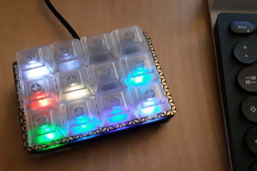

# Multibow

GitHub: [github.com/thediveo/multibow](https://github.com/thediveo/multibow)

Multibow turns a [Pimoroni Keybow](https://shop.pimoroni.com/products/keybow)
into a macro keyboard with multiple layouts, switchable at any time. (Keybow is
a solderless DIY 4x3 mechanical USB keyboard, powered by a Raspberry Pi. And
yes, these days even keyboards run Linux...)



Layouts included:
- Debug Go programs and packages in VisualStudio Code with its Go extension.
- "Empty" keyboard layout what does nothing, very useful when using cycling between different keyboard layouts to have one non-reacting layout.
- permanent layout for cycling between the other layouts and for changing the keybow LED brightness.

## Licenses

Multibow is (c) 2019 Harald Albrecht and is licensed under the MIT license, see
the [LICENSE](LICENSE) file.

The file `keybow.lua` included from
[pimoroni/keybow-firmware](https://github.com/pimoroni/keybow-firmware) for
testing purposes is licensed under the MIT license, as declared by Pimoroni's
keybow-firmware GitHub repository.

## Installation

1. Download the [Pibow
firmware](https://github.com/pimoroni/keybow-firmware/releases) and copy all
files inside its `sdcard/` subdirectory onto an empty, FAT32 formatted microSD
card. Copy only the files **inside** `sdcard/`, but do **not** place them into a
~~`sdcard`~~ directory on your microSD card.

2. Download all files from the `sdcard/` subdirectory of this repository and
then copy them onto the microSD card. This will overwrite but one file
`key.lua`, all other files are new.

## Multiple Keyboard Layouts

To enable one or more multibow keyboard layouts, edit `sdcard/keys.lua`
accordingly to require them. The default configuration is as follows:

```lua
require "layouts/shift" -- for cycling between layouts.
require "layouts/vsc-golang" -- debugging Go programs in VisualStudio Code.
require "layouts/empty" -- empty, do-nothing layout.
```


## Developing

For some basic testing, run `lua test.lua` from the base directory of this
repository. It pulls in `keybow`, then mocks some functionality of it, and
finally starts `sdcard/keys.lua` as usual.

This helps in detecting syntax and logic erros early, avoiding the
rinse-and-repeat cycle with copying to microSD card, starting the Keybow
hardware, and then wondering what went wrong, without any real clue.
